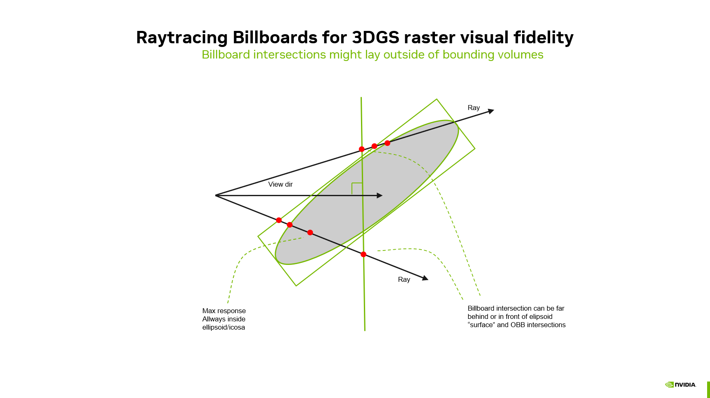
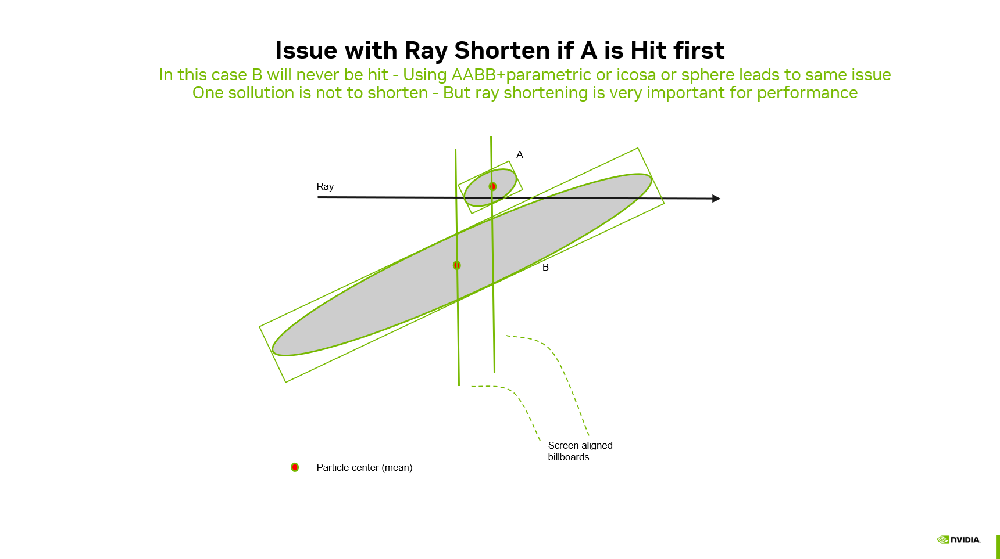
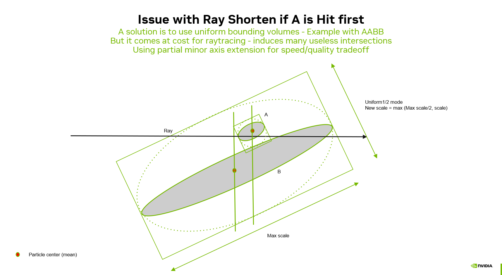
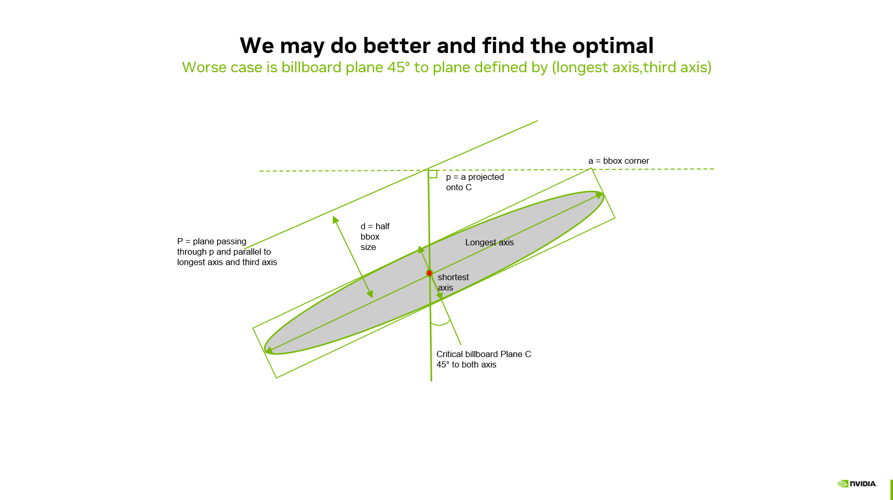
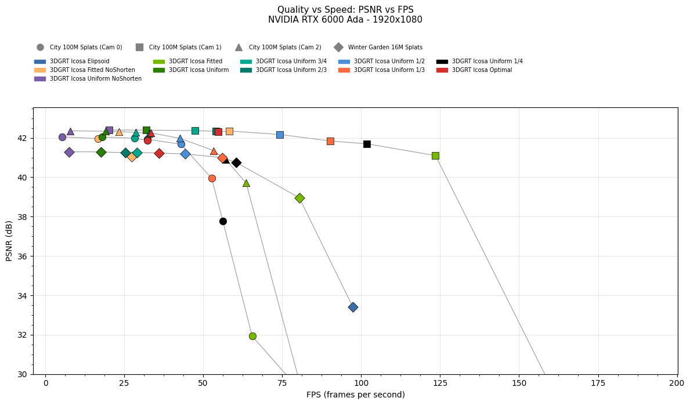
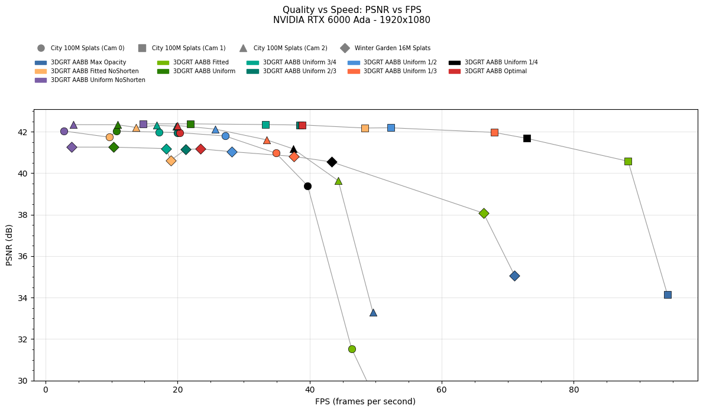
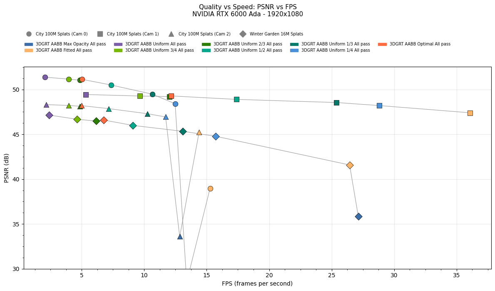

# Billboard Ray Tracing: Matching 3DGS Rasterization in a Ray Tracing Pipeline

<div class="b-dics">
  
  
  
</div>

*Three-way comparison of a 3DGS scene rendered with different depth modes on pathological case. **Raster Reference** (center) is the ground truth produced by the rasterization pipeline. **AABB + Billboard Optimal** (right) uses the billboard intersection shader to match the raster alpha model and closely reproduces the reference. **AABB + Max Opacity** (left) uses the standard 3DGRT ellipsoidal kernel, which evaluates a 3D Gaussian along the ray and produces visible differences due to the training-evaluation mismatch. Both ray-traced images use the Stochastic Anyhit 1SPP trace strategy, after 200 frames.*

The default ray tracing pipeline (3DGRT) evaluates each particle as a 3D ellipsoidal Gaussian kernel. While physically principled, this approach differs from the training objective of original 3DGS [Kerbl2023], which projects each 3D Gaussian onto a 2D screen-space ellipse and evaluates a 2D Gaussian function on that ellipse. Models trained with the standard 3DGS pipeline are optimized for this 2D projection model, so rendering them with a 3D kernel can introduce subtle visual discrepancies.

**Billboard mode** bridges this gap by replicating the 3DGS rasterization alpha model inside the ray tracing pipeline. Instead of evaluating a 3D Gaussian along the ray, each particle is intersected as a camera-facing billboard plane, and the opacity is computed using the same 2D projected covariance and conic evaluation that the rasterizer uses. The result is a ray-traced image that visually matches the rasterized output while retaining ray tracing benefits such as secondary rays for reflections and refractions.

## 1. Availability {: #availability }

Billboard availability depends on the combination of trace strategy and particle format:

| | AABB (Parametric) | Icosahedron | Sphere |
|---|:---:|:---:|:---:|
| **All pass** | <span class="tick">✓</span> | ✗ | ✗ |
| **Stochastic pass** | <span class="tick">✓</span> | ✗ | ✗ |
| **Stochastic any hit** | <span class="tick">✓</span> | <span class="tick">✓</span> | <span class="tick">✓</span> |

With **AABB geometry**, billboard depth is computed in a dedicated intersection shader, making it available for all trace strategies. For **Icosahedron** and **Sphere** geometry, billboard depth is computed in the any-hit shader and is only available with the **Stochastic any hit** strategy. Billboard mode is the default when AABB geometry is selected.

## 2. Motivation {: #motivation }

3DGS rasterization and 3DGRT ray tracing use fundamentally different alpha models:

| Aspect | Rasterization (3DGS) | Ray Tracing (3DGRT) |
|---|---|---|
| **Primitive** | Screen-aligned 2D quad | 3D bounding volume (icosahedron, AABB, or sphere). AABB billboard mode uses a dedicated intersection shader. |
| **Alpha evaluation** | 2D Gaussian on the projected ellipse via the conic (inverse 2D covariance) | 3D Gaussian kernel evaluated along the ray's closest approach to the particle center |
| **Depth ordering** | Global back-to-front sort | Per-ray insertion sort in the any-hit shader |
| **Projection** | Jacobian-based affine approximation of the perspective projection | Parametric ray-ellipsoid intersection in 3D |

Since 3DGS models are trained against the rasterization objective, small discrepancies between the two alpha models can lead to differences in opacity, silhouette sharpness, and overall appearance. Billboard mode eliminates these discrepancies for primary rays by adopting the rasterization alpha model within the ray tracing framework.

## 3. Principle {: #principle }

The core idea is to treat each particle as a flat billboard plane positioned at the particle center and oriented perpendicular to the camera view direction. The ray's intersection point with this billboard plane is projected to screen space and evaluated against the 2D conic, exactly as the rasterizer would.



This approach replaces two operations in the standard 3DGRT pipeline:

1. **Distance computation**: instead of using the hardware-reported `RayTCurrent()` (the ray parameter at the bounding-volume intersection), the intersection shader (or the any-hit shader, depending on the selected mode) computes the ray parameter at the billboard plane intersection.
2. **Alpha evaluation**: instead of transforming the ray into the particle's canonical space and evaluating a 3D kernel, the ray generation shader projects the billboard hit point to screen space and evaluates the 2D Gaussian using the same Jacobian-based covariance projection and conic formulation that the rasterizer uses.

For secondary rays (bounces > 0), billboard mode falls back to the standard 3DGRT ellipsoidal kernel, since the 2D projection model is defined relative to the primary camera and does not generalize to arbitrary ray directions.

**Bounding volumes.** Matching the raster alpha model also depends on *finding* every relevant billboard intersection. RTX only runs the intersection or any-hit shaders after a ray hits the particle’s acceleration-structure bounds. Those bounds are built from the 3D ellipsoid scales $(s_x, s_y, s_z)$ and rotation and are chosen to enclose the **3D kernel**, not the camera-facing billboard plane that actually carries the 2D Gaussian. For **anisotropic** particles, a tight fitted box can be narrow along axes where the billboard still spans the ray, so the hardware never reports a hit even though the plane intersection and conic evaluation would be valid. Accurate billboard tracing therefore requires **purpose-built bounding volumes**: the BLAS/TLAS geometry must be scaled (or uniformly inflated) so the billboard plane lies inside the reported bounds from all view directions, at the cost of extra traversal when bounds are looser. The following sections cover [Billboard Distance Computation](#billboard-distance-computation) and [2D Gaussian Evaluation on the Billboard](#2d-gaussian-evaluation-on-the-billboard) first; [Billboard Bounding Volumes](#billboard-bounding-volumes) then describes how those bounds are constructed and the available quality–performance modes.

## 4. Billboard Distance Computation {: #billboard-distance-computation }

Billboard mode is activated via the compile-time macro `RTX_PARTICLE_DEPTH`, set to `PARTICLE_DEPTH_BILLBOARD`. This macro gates the distance and hit-processing paths described below.

For primary rays (bounce 0), the billboard distance is the intersection of the ray with a plane passing through the particle center, oriented perpendicular to the camera view direction — matching the screen-aligned billboard used in rasterization:

$$t_{\text{billboard}} = \frac{(\mathbf{c} - \mathbf{o}) \cdot \mathbf{n}_{\text{view}}}{\mathbf{d} \cdot \mathbf{n}_{\text{view}}}$$

where $\mathbf{c}$ is the particle center, $\mathbf{o}$ is the ray origin, $\mathbf{d}$ is the ray direction, and $\mathbf{n}_{\text{view}}$ is the camera view direction (all in model space).

For secondary rays (bounce > 0), the plane normal is the ray direction itself, which reduces to a simple projection of the center onto the ray. This can produce negative distances when the particle center is behind the ray origin; such hits are rejected by the caller.

How this distance is computed depends on the particle geometry mode:

### 4.1. AABB Geometry (Intersection Shader) {: #aabb-geometry-intersection-shader }

With **AABB geometry** (parametric particle format), the billboard distance is computed in a dedicated intersection shader ([threedgrt_raytrace.rint_billboard.slang]({{ source_base }}/shaders/threedgrt_raytrace.rint_billboard.slang){:target="_blank"}). The particle center $\mathbf{c}$ is obtained from the translation row of `ObjectToWorld4x3()` (the TLAS instance transform), and the plane normal $\mathbf{n}_{\text{view}}$ is the camera view direction transformed to model space. All quantities are in model space — note that `WorldRayOrigin()`/`WorldRayDirection()` return model-space values because `TraceRay` is called with a model-space ray.

The intersection shader reports $t_{\text{billboard}}$ via `ReportHit()`, so the any-hit shader receives the billboard distance directly as `RayTCurrent()`. Because the hardware-reported hit distance matches the billboard distance, this approach enables billboard mode for **all trace strategies** — not just stochastic any-hit.

#### 4.1.1. Extent culling {: #extent-culling }

Before reporting a hit, the intersection shader applies **extent culling** using `particleRayMinSquaredDistance` — the perpendicular distance from the ray to the particle center in canonical space. This matches the acceptance criterion of the standard ellipsoid intersection shader (`particleDensityHitInstance`). The threshold is set to 1.0 (1σ), which is tighter than the ellipsoid shader's 9.0 (3σ) and yields better PSNR against the rasterization ground truth while reducing the number of hits evaluated by the any-hit shader.

#### 4.1.2. Dual-SBT Selection {: #dual-sbt-selection }

The ray generation shader dynamically selects between the standard and billboard intersection shaders using the SBT (Shader Binding Table) record offset:

``` c
// SBT offset 0 = standard intersection shader
// SBT offset 1 = billboard intersection shader (AABB + billboard only)
const uint particleSbtOffset = (bounce == 0) ? 1 : 0;
traceRayAllSplatTlas(ray, rayFlags, payload, particleSbtOffset);
```

Primary rays (bounce 0) use the billboard intersection shader; secondary rays and shadow rays fall back to the standard intersection shader for correct 3D evaluation.

#### 4.1.3. Any-hit shader {: #any-hit-shader-aabb }

In the any-hit shader ([threedgrt_raytrace.rahit.slang]({{ source_base }}/shaders/threedgrt_raytrace.rahit.slang){:target="_blank"}), `RayTCurrent()` already holds the billboard distance reported by the intersection shader — no `computeBillboardDist` call is needed.

In **stochastic any-hit** mode, hit processing runs inline: `threedgsProcessHit` evaluates opacity and performs stochastic acceptance in the any-hit stage. Because the hardware-reported distance matches the billboard plane distance, traversal order stays consistent with billboard depth along the ray.

### 4.2. Icosahedron / Sphere Geometry (Any-Hit Shader) {: #icosahedron-sphere-geometry-any-hit-shader }

For **icosahedron** and **sphere** geometry, there is no custom intersection shader — the hardware performs the intersection against the triangle mesh or sphere primitive. The billboard distance is computed in the any-hit shader ([threedgrt_raytrace.rahit.slang]({{ source_base }}/shaders/threedgrt_raytrace.rahit.slang){:target="_blank"}) by the `computeBillboardDist` function. Because the billboard distance does not correspond to the hardware-reported `RayTCurrent()`, the distance values in the payload do not correlate with the hardware traversal order. This path is therefore limited to the **stochastic any-hit 1SPP** strategy (`PARTICLES_SPP = 1`): a single candidate hit per `traceRay` call, with no ordered multi-hit insertion or `tMin` advancement across passes.

#### 4.2.1. Any-hit shader {: #any-hit-shader-icosahedron-sphere }

The any-hit shader replaces `RayTCurrent()` with the distance returned by `computeBillboardDist`. Hits whose billboard distance lies behind the active ray interval (`<= RayTMin()`) are rejected via `IgnoreHit()`.

In **stochastic any-hit** mode, `threedgsProcessHit` is called directly in the any-hit shader for opacity evaluation and stochastic acceptance. The early-out that skips hits farther than the current farthest payload sample is **disabled** in billboard mode on this path, because billboard distance does not follow hardware traversal order.

### 4.3. Frustum Culling {: #frustum-culling }

Billboard mode includes an optional **frustum culling** step during distance computation (compile-time macro `RTX_BILLBOARD_FRUSTUM_CULLING`, toggled by **Billboard frustum culling** in the UI). For **primary rays only** (bounce 0), the particle center is transformed to normalized device coordinates (NDC) and tested against the camera frustum, with configurable dilation via `frameInfo.frustumDilation`:

$$\text{reject if } |x_{\text{ndc}}| > 1 + d,\; |y_{\text{ndc}}| > 1 + d,\; z_{\text{ndc}} < -d,\; \text{ or } z_{\text{ndc}} > 1$$

where $d$ is the frustum dilation. Particles whose center falls outside this region are discarded before a billboard hit is reported or before `computeBillboardDist` returns a valid distance.

Where this runs depends on the geometry mode:

| Geometry | Shader | When |
|----------|--------|------|
| **AABB (parametric)** | [threedgrt_raytrace.rint_billboard.slang]({{ source_base }}/shaders/threedgrt_raytrace.rint_billboard.slang){:target="_blank"} | After billboard plane + extent checks, before `ReportHit()` |
| **Icosahedron / sphere** | [threedgrt_raytrace.rahit.slang]({{ source_base }}/shaders/threedgrt_raytrace.rahit.slang){:target="_blank"} → `computeBillboardDist()` | At the start for bounce 0; returns `-1.0` if the center is outside the NDC frustum |

This culling matches the rasterization distance compute shader, which also culls particles by center position in NDC. Without it, rays near the viewport border can intersect particles that the rasterizer would never draw, producing visible border artifacts when comparing RTX and raster output. **Secondary rays** skip frustum culling because they travel in arbitrary directions where screen-space frustum tests do not apply.

## 5. 2D Gaussian Evaluation on the Billboard {: #2d-gaussian-evaluation-on-the-billboard }

Once a billboard hit is accepted, the `threedgsProcessHit` function ([threedgrt.h.slang]({{ source_base }}/shaders/threedgrt.h.slang){:target="_blank"}) evaluates the particle's opacity using the same steps as the rasterizer:

1. **Build the 3D covariance matrix** from the particle's scale and rotation quaternion: $\Sigma = R \cdot S^2 \cdot R^T$.

2. **Project to 2D** using the Jacobian-based affine approximation of the perspective projection, via the shared `threedgsCovarianceProjection` function ([threedgs.h.slang]({{ source_base }}/shaders/threedgs.h.slang){:target="_blank"}). This is the same function used by the rasterization vertex and mesh shaders.

3. **Apply covariance dilation** (low-pass filter) and optionally MipSplatting antialiasing, matching the rasterizer's behavior.

4. **Compute the conic** (inverse of the 2×2 projected covariance):

$$\text{conic} = \Sigma_{2D}^{-1}$$

5. **Project the billboard hit point to screen space**: the 3D hit point $\mathbf{o} + t_{\text{billboard}} \cdot \mathbf{d}$ is transformed to view space and then to pixel coordinates using the focal length.

6. **Evaluate the 2D Gaussian** at the screen-space offset between the hit point and the particle center:

$$\alpha = \min\!\bigl(\alpha_{\text{clamp}},\; \exp\!\bigl(-\tfrac{1}{2}\, \mathbf{\delta}^T \Sigma_{2D}^{-1} \mathbf{\delta}\bigr) \cdot \rho\bigr)$$

where $\mathbf{\delta}$ is the 2D screen-space displacement from the particle center to the hit point, and $\rho$ is the particle's stored opacity.

**Extent cutoff**: To match the raster mesh shader's finite quad extent, `threedgsProcessHit` rejects hits where the Mahalanobis distance exceeds 8.0. This threshold corresponds to the raster's `stdDev = sqrt(8)` parameter used in `threedgsProjectedExtentBasis`, at which point the quad boundary is reached. Without this cutoff, high-opacity particles would produce a visible halo beyond the rasterizer's rendering boundary.

This evaluation is mathematically identical to the rasterizer's fragment shader computation, ensuring visual consistency.

### 5.1. Ray generation shader {: #ray-generation-shader }

For trace strategies that defer hit evaluation to the ray generation pass (**all pass**, **stochastic pass**), [threedgrt_raytrace.rgen.slang]({{ source_base }}/shaders/threedgrt_raytrace.rgen.slang){:target="_blank"} dispatches to `threedgsProcessHit` on bounce 0 and falls back to `threedgrtProcessHit` (3DGRT ellipsoidal kernel) on later bounces. Primary rays therefore use the 2D conic model; secondary rays keep physically correct 3D evaluation.

``` c
if (bounce == 0)
    acceptedHit = threedgsProcessHit(...)   // billboard: 2D conic evaluation
else
    acceptedHit = threedgrtProcessHit(...)   // standard: 3D ellipsoidal kernel
```

Compositing (front-to-back alpha blending via `threedgrtIntegrate`) is unchanged — only the per-hit alpha and radiance differ. Transmittance termination and hit counting proceed as in standard 3DGRT.

## 6. Billboard Bounding Volumes {: #billboard-bounding-volumes }

The sections above describe how a reported hit is turned into a billboard distance and a raster-consistent alpha. This section explains how bounding volumes are sized at acceleration-structure build time so those hits are not missed in the first place, and how to balance correctness against traversal performance.

### 6.1. The Problem {: #bounding-volumes-problem }

Billboard mode intersects a camera-facing plane through the particle center. For this intersection to be reported by the hardware, the plane must lie within the particle's bounding volume as built into the acceleration structure. For AABB geometry this is the axis-aligned bounding box; for icosahedron/sphere geometry it is the mesh or sphere radius. In all cases, the volume is constructed from the particle's 3D scales $(s_x, s_y, s_z)$ and rotation — it tightly encloses the **3D ellipsoid**, not the screen-aligned billboard. Tight ellipsoid bounds are a poor outer approximation of the billboard footprint. That leads to **Intersection ordering errors with ray shortening.** 

At the end of `processHitStochastic` in [threedgrt_raytrace.rahit.slang]({{ source_base }}/shaders/threedgrt_raytrace.rahit.slang){:target="_blank"}:

``` c
#if RTX_SHORTEN_RAY
  if(payload.dist[PARTICLES_SPP - 1] > RayTCurrent())
#endif
  {
    IgnoreHit();
  }
```

When `RTX_SHORTEN_RAY` is defined, `IgnoreHit()` is called only if the farthest stored sample distance in the payload is **greater** than `RayTCurrent()`. In Vulkan, `IgnoreHit()` lets traversal continue and can raise the ray's $t_{\min}$ toward `RayTCurrent()`, skipping geometry farther along the ray. That is a large win when bounds align with depth order, but it assumes that shortening at the current bound hit does not discard particles whose **billboards** are still in front along the ray.



If the ray meets particle **A**'s bounding volume before **B**'s, shortening at A's `RayTCurrent()` can end traversal before B's volume is tested — even when B's billboard plane is closer to the camera. That can happen for **AABB (parametric)**, **icosahedron**, and **sphere** geometry whenever the order of bound hits along the ray does not match the order of billboard depths.

You can address this in two ways. **Disable Shorten ray** — traversal never advances $t_{\min}$ from a bound hit alone, so ordering mistakes cannot skip a closer billboard; cost is more traversal work. **Enlarge bounding volumes** (the modes below) — each particle's bound is more likely to contain its billboard plane (fewer missed hits) and less likely to sit entirely behind a closer particle's bound (fewer harmful shortenings). In practice you often combine a conservative bound mode with shortening enabled.

**Uniform (cubic)** bounds set every axis to $M = \max(s_x, s_y, s_z)$, producing a cube that contains the billboard plane for typical viewing directions. **Uniform fraction** modes (1/4 … 3/4) and **Optimal** shrink that cube toward the fitted ellipsoid scales; tighter bounds mean faster traversal but a smaller safety margin for both missed intersections and shortening order. Shortening can still go wrong if two enlarged volumes overlap along the ray and the farther bound is hit first — cubic bounds reduce how often that happens, but they do not guarantee correct order in every overlap case.

The **billboard bounding mode** system spans this range from tight **Fitted** scales to fully **Uniform** cubes.

### 6.2. Bounding Mode Families {: #bounding-mode-families }

#### 6.2.1. Fitted (mode 0) {: #fitted-mode-0 }

$$\mathbf{s}_{\text{out}} = (s_x,\, s_y,\, s_z)$$

Uses the original per-axis scales unchanged. Tightest bounds, fastest traversal, but can miss billboard hits for anisotropic particles.

#### 6.2.2. Uniform Variants (modes 1–6) {: #uniform-variants-modes-1-6 }



Each axis is clamped to a minimum fraction $f$ of the maximum scale $M = \max(s_x, s_y, s_z)$:

$$\mathbf{s}_{\text{out}} = \bigl(\max(s_x,\, fM),\; \max(s_y,\, fM),\; \max(s_z,\, fM)\bigr)$$

| Mode | Fraction $f$ | Effect |
|------|:---:|---|
| Uniform | 1 | Fully cubic: $\mathbf{s}_{\text{out}} = (M, M, M)$ |
| Uniform 3/4 | 3/4 | Minimum axis is 75% of max |
| Uniform 2/3 | 2/3 | Minimum axis is 67% of max |
| Uniform 1/2 | 1/2 | Minimum axis is 50% of max |
| Uniform 1/3 | 1/3 | Minimum axis is 33% of max |
| Uniform 1/4 | 1/4 | Minimum axis is 25% of max |

Lower fractions give tighter bounds (closer to fitted) at the cost of potentially missing more billboard hits on highly anisotropic particles.

#### 6.2.3. Optimal (mode 7) {: #optimal-mode-7 }

The Uniform modes apply the same fraction to all particles regardless of their shape. This means that for nearly isotropic particles the bounding volume is unnecessarily expanded, while for highly anisotropic particles a given fraction may still be too tight. The Optimal mode resolves this by computing a per-particle bounding volume based on the actual shape of each particle.

Given a particle with per-axis scales $(s_x, s_y, s_z)$ — the same extent factors used for Fitted and Uniform modes (see [particle AS build]({{ source_base }}/shaders/particle_as_build.comp.slang){:target="_blank"} and distance compute) — and $M = \max(s_x, s_y, s_z)$, the optimal output scale on each axis is:

$$s_i^{\text{out}} = \frac{M + s_i}{2}$$


*Consider the bounding box corner $\mathbf{a} = (M, s_i)$ in the plane formed by the longest axis and axis $i$. Project $\mathbf{a}$ perpendicularly onto the 45-degree line through the origin to obtain point $\mathbf{p}$. The distance from the origin to the face of the enlarged box along axis $i$ that contains the billboard at a 45° grazing angle is $(M + s_i) / 2$ in these same scale units. That value is the minimum per-axis extent that keeps the billboard plane inside the BLAS bounds for that viewing direction.*

<!-- Image: optimal billboard bounding geometry (corner (M, s_i), 45° projection, output scale (M + s_i) / 2) -->

**Key properties:**

* For **isotropic particles** ($s_i = M$): the result is $M$, identical to Fitted — no expansion needed since the bounding box is already cubic.
* For **maximally anisotropic particles** ($s_i \to 0$): the result is $M/2$, equivalent to Uniform 1/2.
* Each axis receives its own optimal value, making the bounding volume **anisotropic** — tighter than any single uniform fraction while remaining geometrically correct.

### 6.3. Performance / Quality Trade-off {: #performance-quality-trade-off }

| Mode | Bounding Tightness | Traversal Speed | Billboard Correctness |
|------|---|---|---|
| Fitted | Tightest | Fastest | Can miss hits for anisotropic particles |
| Uniform | Loosest (cubic) | Slowest | Near lossless |
| **Optimal** | **Per-particle optimal** | **Fastest near-lossless** | **Near lossless** |
| Uniform 3/4, 2/3, 1/2, 1/3, 1/4 | Intermediate | Intermediate | Partial (depends on anisotropy) |

**Optimal** provides the fastest rendering speed achievable without compromising quality — it is the tightest bounding volume that still guarantees correctness for all particles from all viewing angles. The Uniform fraction modes (1/4 through 3/4) allow trading quality for additional speed beyond what Optimal provides, at the cost of missed billboard hits on anisotropic particles.

Measured frame times and PSNR for these modes on benchmark scenes are summarized in [Performance results](#performance-results).

### 6.4. Implementation {: #bounding-volumes-implementation }

Primitive scaling is applied during the acceleration structure build in the compute shader [particle_as_build.comp.slang]({{ source_base }}/shaders/particle_as_build.comp.slang){:target="_blank"}. The modified scale is used to compute the AABB extents (or icosahedron/sphere radii) written into the BLAS build input. The scaling does not affect the billboard intersection itself — only the bounding volume that determines whether the hardware traversal visits a given particle.

The bounding mode index is passed to the shader as a push constant.

## 7. UI Controls {: #ui-controls }

Billboard mode is configured in the **Renderer > Properties > Ray tracing** panel:

* **Particle format**: with **AABB (Parametric)** geometry, billboard mode is available for all trace strategies and is activated by default. For **Icosahedron** and **Sphere** geometry, billboard mode requires the **Stochastic any hit** trace strategy.
* **Particle depth** selector:
    * **Billboard (3DGS/3DGUT)** — activates billboard mode. Depth is the ray-to-billboard-plane intersection.
    * **Ellipsoid (3DGRT)** — standard mode. For AABB geometry (custom intersection shader), depth is the point of maximum density along the ray (closest approach to the ellipsoid center in canonical space). For Icosahedron/Sphere geometry (hardware intersection), depth is the actual ellipsoid surface hit distance.
* **Billboard frustum culling** — when billboard mode is active, toggles per-particle NDC frustum culling during [Frustum Culling](#frustum-culling). Enabled by default.
* **Billboard bounding mode** — selects how particle bounding volumes are scaled during AS build (see [Billboard Bounding Volumes](#billboard-bounding-volumes) above). Options: Fitted, Uniform, Uniform 3/4, Uniform 2/3, Uniform 1/2, Uniform 1/3, Uniform 1/4, Optimal. Default is **Fitted**; **Optimal** is the recommended setting when visual parity with rasterization matters. Changing the mode triggers a BLAS rebuild.
* **Shorten ray** — available when billboard mode is active with the **Stochastic any hit** trace strategy. When enabled (default), the farthest accepted hit distance in the payload is used to shorten the active ray segment so traversal can skip particles beyond that distance. Disable for debugging or when comparing against benchmarks that turn this optimization off.

If billboard mode is not available for the current combination of trace strategy and particle format, the particle depth selector is disabled and automatically reverts to ellipsoid mode.

## 8. Performance results {: #performance-results }

The charts below come from the automated billboard benchmark (`benchmark_billboards.cfg` / `3DGS_BILLBOARDS`; see [Benchmarking](../benchmarking.md)). Each point is one **bounding mode** on one **test scene and camera** (City 100M Splats, cameras 0–2, and Winter Garden 16M Splats, camera 0). **PSNR** is measured against the raster mesh reference; **FPS** is derived from averaged CPU frame time in the benchmark log. Marker shape identifies the scene/camera; color identifies the mode (dark blue: ellipsoid/max opacity depth baselines). Grey segments connect modes for the same scene, ordered by increasing FPS.

### 8.1. Icosahedron billboards (stochastic any-hit)


*Icosahedron mesh particles + billboard depth, **stochastic any-hit 1SPP** trace strategy, 200 frames accumulated. PSNRs agains raster reference. Modes include Fitted and Uniform (with and without **Shorten ray**), uniform fractions (1/4–3/4), **Optimal**, and an ellipsoid-depth baseline. Tighter bounds (e.g. Fitted) increase FPS but can lower PSNR on anisotropic content; **Uniform** and **Optimal** sit closest to the quality/speed knee. 1920×1080, NVIDIA RTX 6000 Ada.*

### 8.2. AABB billboards (stochastic any-hit)


*Parametric **AABB** particles with the billboard intersection shader, **stochastic any-hit 1SPP** trace strategy, 200 frames accumulated. PSNRs agains raster reference. Same bounding-mode family as the icosahedron chart; **Shorten ray** variants are included. **Optimal** and full **Uniform** bounds typically achieve near-reference PSNR at lower cost than a fully cubic **Uniform** bound. 1920×1080, NVIDIA RTX 6000 Ada.*

### 8.3. AABB billboards (all-pass)


*Same AABB billboard configuration as the stochastic chart above, but **all-pass** hit sorting (`rtxSortStrategy 0`). Icosahedron billboards do not support all-pass; **NoShorten** modes are omitted because **Shorten ray** does not apply. 1920×1080, NVIDIA RTX 6000 Ada.*

## 9. Visual Results {: #visual-results }

<div class="b-dics">
  
  
  
</div>

*Three-way comparison of a 3DGS scene rendered with different depth modes. **Raster Reference** (center) is the ground truth produced by the rasterization pipeline. **AABB + Fitted Billboard** (right) uses the billboard intersection shader to match the raster alpha model and closely reproduces the reference. **AABB + Max Opacity** (left) uses the standard 3DGRT ellipsoidal kernel, which evaluates a 3D Gaussian along the ray and produces visible differences due to the training-evaluation mismatch. Both ray-traced images use the Stochastic any-hit trace strategy.*

## 10. References {: #references }

Please consult the consolidated [References](../references.md) section.
