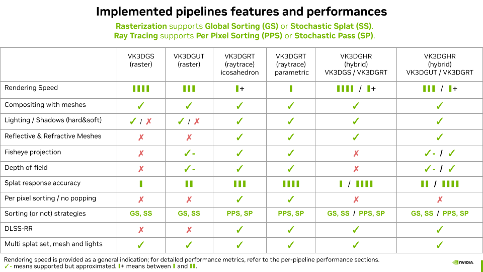

# Vulkan Gaussian Splatting

Welcome to the **Vulkan Gaussian Splatting** documentation.

This project is a **testbed** to explore and compare various approaches to **real-time visualization** of **3D Gaussian Splatting (3DGS)** and related evolutions using the **Vulkan API**.

## Rendering Pipelines

The sample implements several rendering pipelines together with technical Deep Dives:

- [**VK3DGSR** — 3D Gaussian Splatting using Vulkan Rasterization](deep-dives/rasterization_of_3d_gaussian_splatting.md)
- [**VK3DGRT** — 3D Gaussian Ray Tracing using Vulkan RTX](deep-dives/ray_tracing_3d_gaussians.md)
- [**VK3DGUT** — 3D Gaussian Unscented Transform using Vulkan Rasterization](deep-dives/rasterization_of_3dgut.md)
- [**VK3DGHR** — 3D Gaussian Hybrid Rendering using Vulkan RTX and Rasterization](deep-dives/hybrid_rendering_3d_gaussians.md)

The following additional technical Deep Dives are also presented:

- [Stochastic Transparency](deep-dives/stochastic_transparency.md)
- [Lighting and Shadows](deep-dives/lighting_and_shadows.md)
- [Billboard Ray Tracing](deep-dives/billboard_ray_tracing.md)

## Features and Performances

Check out the [Release Notes](release-notes.md) and [Feature Videos](feature-videos.md) for the latest updates and showcases.
