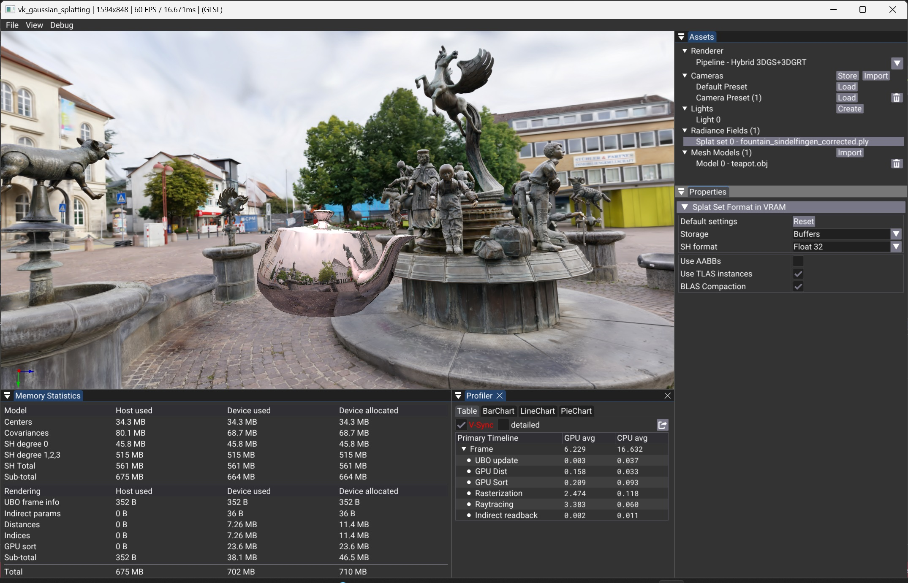

# Assets and Properties Panels

The **Assets** panel regroups access to the **Renderer** and to the different scene elements; **Cameras**, **Lights**, **Radiance Fields** and **Meshes**.

Selecting an Asset in the Assets Panel will generally open its related properties in the Properties panel located below.
